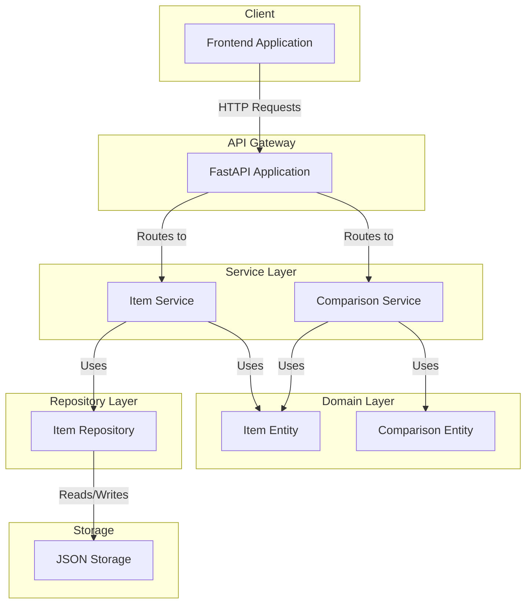
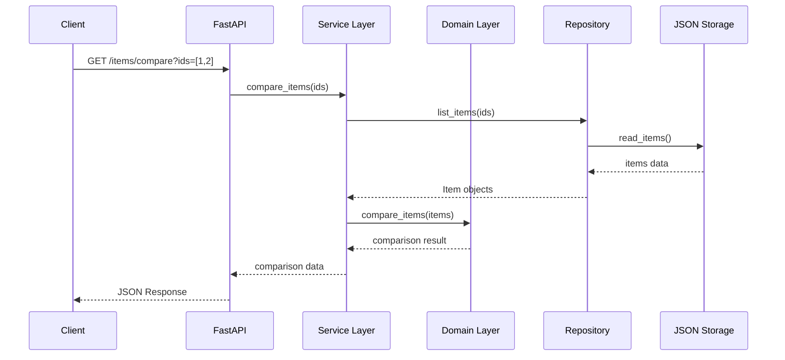
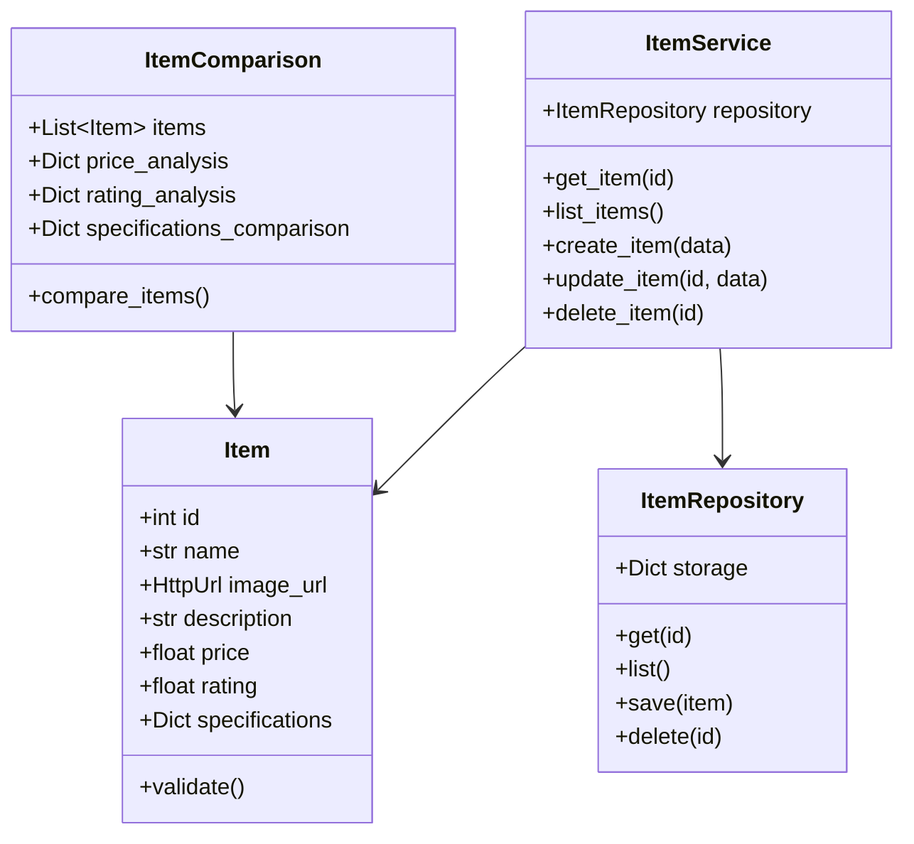
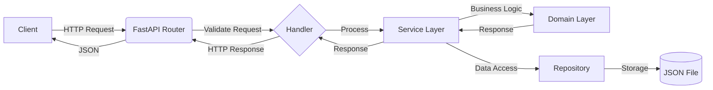

# Arquitetura do Item Comparison API

## Diagrama de Componentes

## Fluxo de Dados

## Estrutura de Dados

## Fluxo de Requisições

## Decisões Arquiteturais

### 1. Clean Architecture
- **Por quê?** Separação clara de responsabilidades, facilitando manutenção e testes
- **Benefício:** Mudanças em uma camada não afetam as outras
- **Impacto:** Código mais organizado e testável

### 2. FastAPI como Framework
- **Por quê?** Performance, tipagem estática e documentação automática
- **Benefício:** Desenvolvimento rápido e seguro
- **Impacto:** API bem documentada e fácil de usar

### 3. Pydantic para Validação
- **Por quê?** Integração nativa com FastAPI e validação robusta
- **Benefício:** Garantia de dados corretos
- **Impacto:** Menos código de validação manual

### 4. Armazenamento em JSON
- **Por quê?** Requisito do projeto para não usar banco de dados
- **Benefício:** Simplicidade e portabilidade
- **Impacto:** Fácil de entender e modificar

### 5. Testes em Múltiplas Camadas
- **Por quê?** Garantia de qualidade em todos os níveis
- **Benefício:** Confiabilidade do código
- **Impacto:** Mudanças seguras e documentadas

## Considerações de Segurança

1. **Validação de Entrada**
   - Todos os dados são validados via Pydantic
   - Proteção contra injeção de dados maliciosos

2. **Limites de Requisição**
   - Máximo de 5 itens por comparação
   - Previne sobrecarga do servidor

3. **URLs Seguras**
   - Validação de URLs de imagens
   - Apenas HTTPS permitido

## Considerações de Performance

1. **Otimizações**
   - Cache de resultados frequentes
   - Respostas compactas

2. **Limitações**
   - Armazenamento em JSON pode ser lento para grandes volumes
   - Recomendado para datasets pequenos/médios

## Evolução Futura

1. **Possíveis Melhorias**
   - Implementação de cache
   - Suporte a banco de dados
   - Autenticação e autorização
   - Sistema de rate limiting

2. **Pontos de Extensão**
   - Novos critérios de comparação
   - Suporte a mais tipos de produtos
   - API de busca avançada
