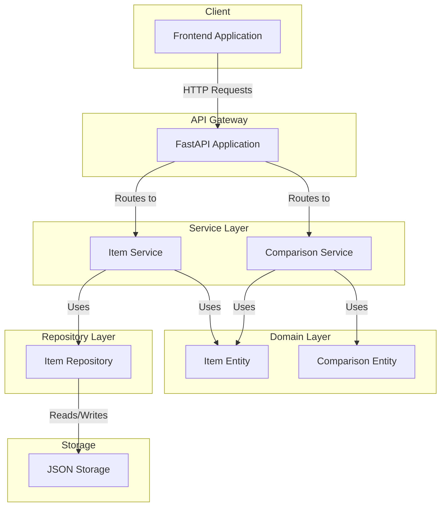
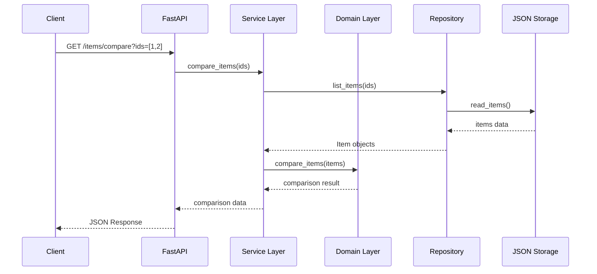
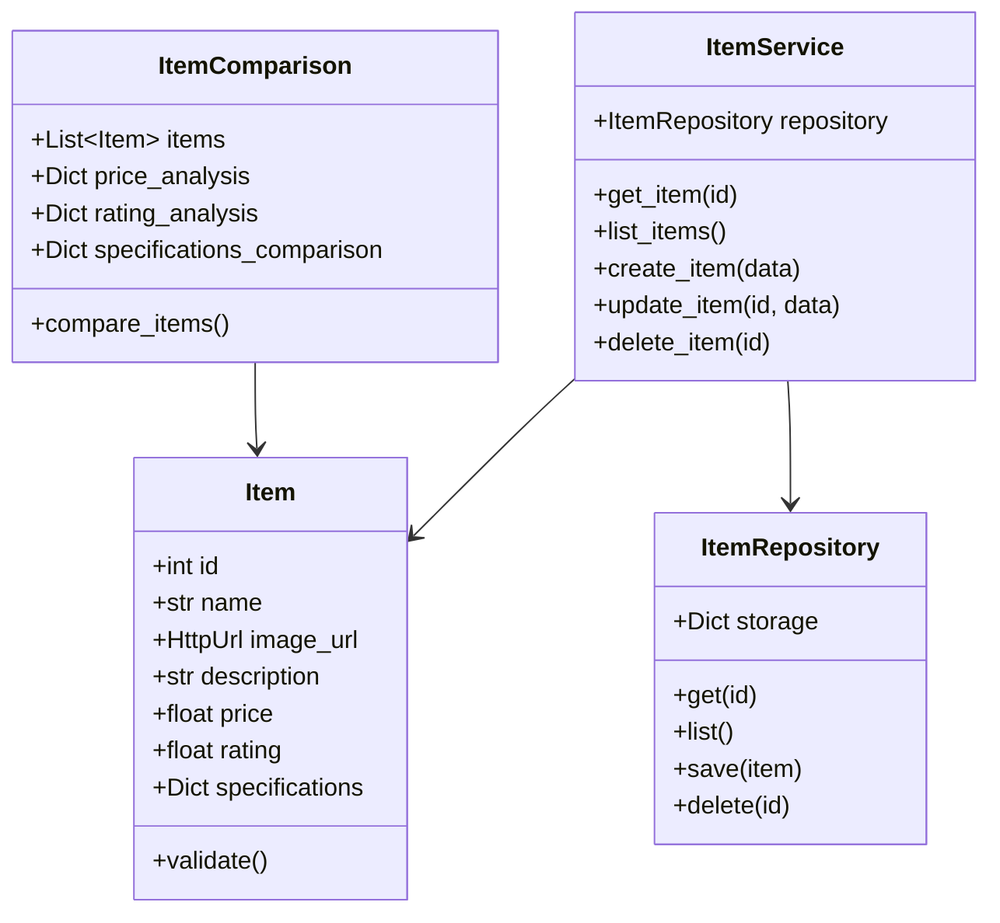
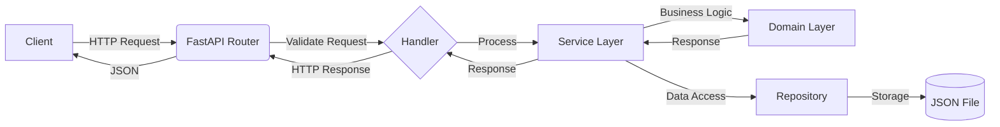

# Arquitetura do Item Comparison API

## Diagrama de Componentes

```mermaid
graph TD
    subgraph Client
        A[Frontend Application]
    end

    subgraph API Gateway
        B[FastAPI Application]
    end

    subgraph Domain Layer
        C[Item Entity]
        D[Comparison Entity]
    end

    subgraph Service Layer
        E[Item Service]
        F[Comparison Service]
    end

    subgraph Repository Layer
        G[Item Repository]
    end

    subgraph Storage
        H[JSON Storage]
    end

    A -->|HTTP Requests| B
    B -->|Routes to| E
    B -->|Routes to| F
    E -->|Uses| C
    F -->|Uses| C
    F -->|Uses| D
    E -->|Uses| G
    G -->|Reads/Writes| H
```

## Fluxo de Dados

```mermaid
sequenceDiagram
    participant Client
    participant API as FastAPI
    participant Service as Service Layer
    participant Domain as Domain Layer
    participant Repo as Repository
    participant Storage as JSON Storage

    Client->>API: GET /items/compare?ids=[1,2]
    API->>Service: compare_items(ids)
    Service->>Repo: list_items(ids)
    Repo->>Storage: read_items()
    Storage-->>Repo: items data
    Repo-->>Service: Item objects
    Service->>Domain: compare_items(items)
    Domain-->>Service: comparison result
    Service-->>API: comparison data
    API-->>Client: JSON Response
```

## Estrutura de Dados

```mermaid
classDiagram
    class Item {
        +int id
        +str name
        +HttpUrl image_url
        +str description
        +float price
        +float rating
        +Dict specifications
        +validate()
    }

    class ItemComparison {
        +List~Item~ items
        +Dict price_analysis
        +Dict rating_analysis
        +Dict specifications_comparison
        +compare_items()
    }

    class ItemRepository {
        +Dict storage
        +get(id)
        +list()
        +save(item)
        +delete(id)
    }

    class ItemService {
        +ItemRepository repository
        +get_item(id)
        +list_items()
        +create_item(data)
        +update_item(id, data)
        +delete_item(id)
    }

    ItemComparison --> Item
    ItemService --> ItemRepository
    ItemService --> Item
```

## Fluxo de Requisições

```mermaid
flowchart LR
    A[Client] -->|HTTP Request| B(FastAPI Router)
    B -->|Validate Request| C{Handler}
    C -->|Process| D[Service Layer]
    D -->|Business Logic| E[Domain Layer]
    D -->|Data Access| F[Repository]
    F -->|Storage| G[(JSON File)]
    E -->|Response| D
    D -->|Response| C
    C -->|HTTP Response| B
    B -->|JSON| A
```
